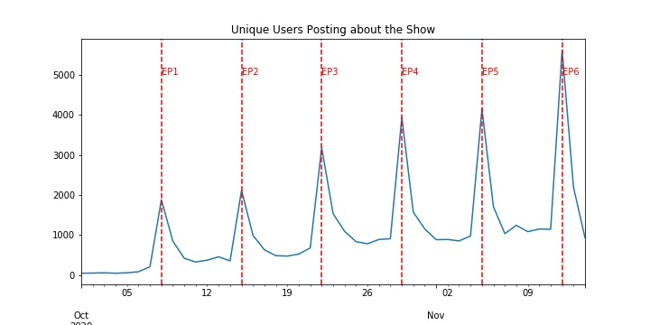

# Tweets-Analysis-with-Twint-and-Pandas

## Introduction
This is a pure-for-fun data science project analyzing the popularity of my FAVORITE Japanese TV Show "#30歳まで童貞だと魔法使いになれるらしい". I gathered all the show related tweets using Twint and produce data visualizations using Pandas. For technical details, please refer to [my Medium post](https://medium.com/towards-artificial-intelligence/getting-valuable-insights-and-visualizations-from-tweets-using-python-and-twint-28d9f9eb9128).

## Visualizations 

### Related Tweets by Date
Definitely a increasing trend with seasonality around the releasing date of the new episodes

### Unique Users by Date
The increasing trend in the total number of tweets about the show can be derived from two reasons:

* Increasing trend in unique users posting about the show. Shows that the show has been attracting more fans.

* The average posts by date also has an increaing trend showing that each user is posting more everyday.

### Related Tweets Actions by Date
* More likes than retweets than replies. It takes more efforts to reply than to retweet than to click a like, thus the action difference.
* Roughly an increasing trend with a slight decrease at EP5, increase at EP6, align with the feedbacks from the episodes.
* Other than peaking at the release date, there are peaks when [official account](https://twitter.com/tx_cherimaho) posts pictures about the scene.(11/08, and 11/10)

### Related Tweets by Hour of the Releasing Date
The discussion peak at the time when the show is on air, even it is at midnight(1am) in Japan.

### Related Tweets for the Actors by Date
Two actors are widely discussed with an increasing trend.

### Related Tweets by Languages
* Most of the discussions are in Japanese
* The show is super popular in Thailand

